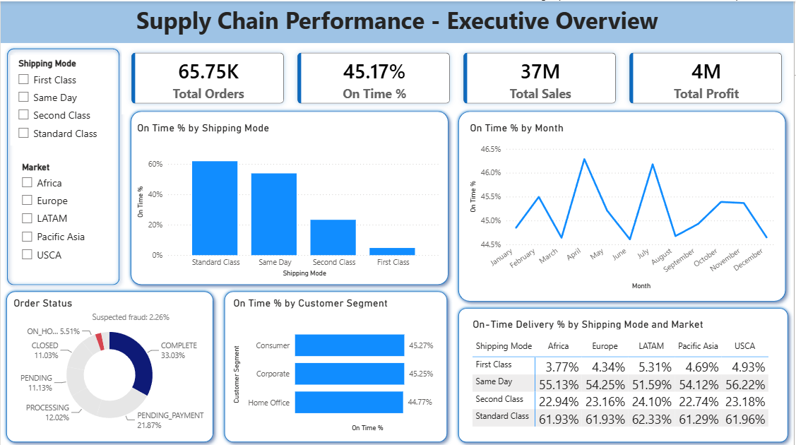
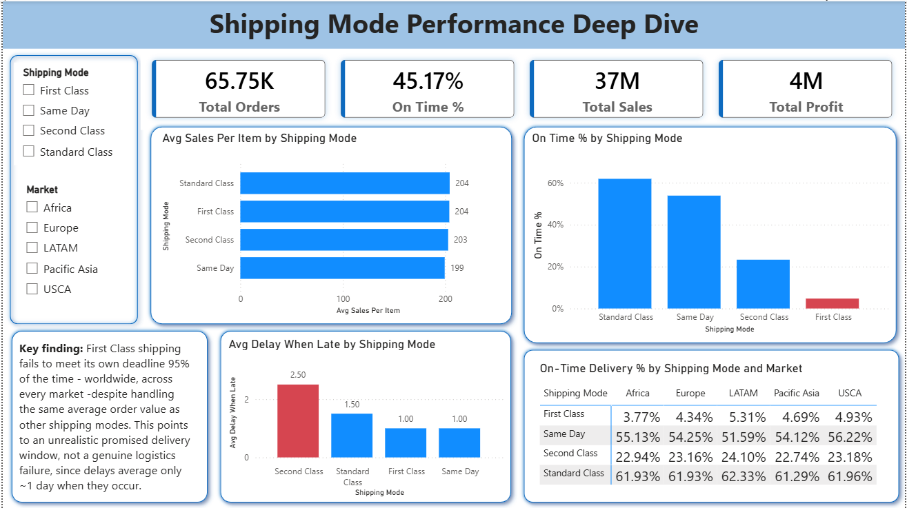
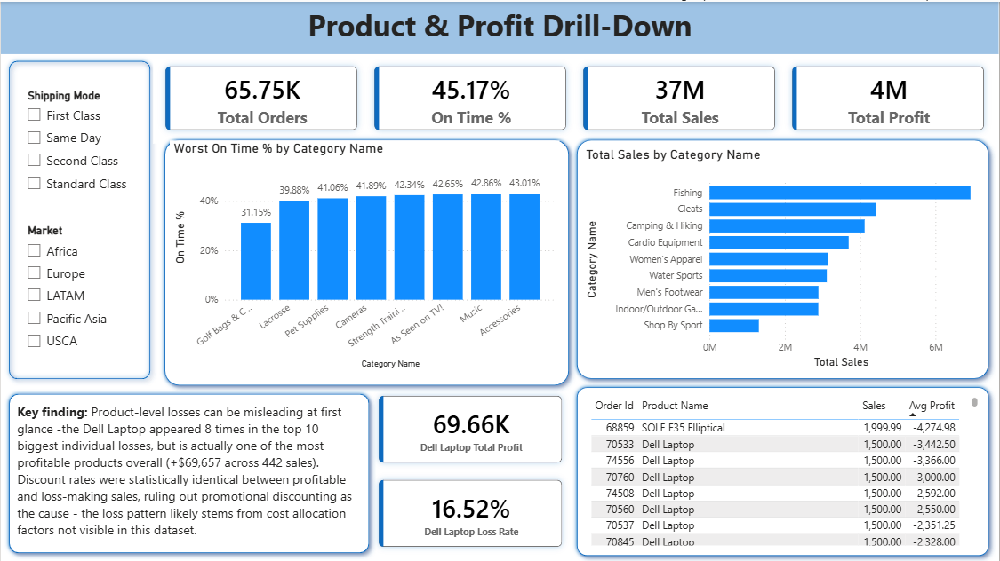

# Supply Chain Analytics — DataCo Smart Supply Chain

An end-to-end supply chain analytics project covering data cleaning (Python), analysis (SQL/PostgreSQL), and dashboarding (Power BI). The goal: understand why delivery performance is inconsistent, quantify its financial impact, and surface actionable, evidence-based recommendations.

## Business question

DataCo's orders are only meeting their promised delivery date **45% of the time**. Where is this coming from — geography, shipping process, product category, or customer type — and what should the business actually do about it?

## Tools used

| Stage | Tool |
|---|---|
| Data cleaning | Python (pandas, Jupyter Notebook) |
| Data storage & analysis | PostgreSQL (SQL) |
| Dashboard & visualization | Power BI |

## Dataset

[DataCo Smart Supply Chain Dataset](https://www.kaggle.com/datasets/shashwatwork/dataco-smart-supply-chain-for-big-data-analysis) (Kaggle) — ~180,000 order records spanning January 2015 to January 2018, covering orders, shipping, products, and customers.

> The raw dataset is not included in this repo due to size. Download it from the link above and place it in `/data` to run the cleaning notebook.

## Project pipeline

1. **Raw CSV** (flat, 53 columns)
2. **Python cleaning** (Jupyter Notebook) — drop dead/PII columns, handle nulls, validate date logic, standardize text
3. **Split into normalized tables** — customers, products, orders, order_items
4. **PostgreSQL** — schema creation + data load
5. **SQL analysis** — 20 queries covering delivery performance, profit impact, and product/customer drill-downs
6. **Power BI dashboard** — 3 pages

## Repository structure

- `README.md`
- `data/` — place raw CSV here (see Kaggle link above)
- `notebooks/`
  - `dataco_cleaning.ipynb` — data cleaning pipeline
- `sql/`
  - `schema.sql` — table creation
  - `analysis_queries.sql` — all 20 analysis queries, commented
- `powerbi/`
  - `supply_chain_dashboard.pbix`
- `images/` — dashboard screenshots
  
## Key findings

**1. Delivery performance is chronically low, and has been for 3+ years.**
Only 45.17% of orders arrive on time. This rate has stayed flat (43–46%) every month from January 2015 through January 2018 — this is a structural issue, not a recent regression.

**2. Shipping mode — not geography, not customer type — explains nearly all the variation.**
On-time rate ranges from **4.73% (First Class)** to **61.87% (Standard Class)** — a 57-point spread. By comparison, on-time rate across 23 regions, 5 markets, and 3 customer segments each varies by only 1–2 points. The delivery problem is a shipping-mode/process issue, not a regional or customer-type issue.

**3. First Class shipping fails almost universally, in every market, with no cost trade-off to explain it.**
First Class ranks last for on-time performance in every single market (Africa, Europe, LATAM, Pacific Asia, USCA) — a completely consistent pattern worldwide. Average order value is nearly identical across all shipping modes (~$200), ruling out "First Class customers buy bigger/more complex orders" as an explanation. When First Class *does* miss its deadline, the average delay is only ~1 day — the smallest of any mode — suggesting the promised delivery window itself is unrealistic, rather than a genuine operational breakdown.

**4. Being late has a modest but real profit cost.**
Late orders average $21.62 profit per item vs. $22.40 for on-time orders (~3.5% lower). Given that 55% of all orders are late, this adds up in aggregate — but the larger business risk is likely customer retention, not immediate margin loss.

**5. A single high-value product can look like a major loss-driver — until you check the full picture.**
The Dell Laptop appeared in 8 of the top 10 highest-loss individual orders. A deeper look showed it's actually one of the most profitable products overall: **+$69,657 total profit across 442 sales**, with only 16.5% of its sales resulting in losses. Discount rates were statistically identical between profitable and loss-making sales (9.85% vs. 10.30%), ruling out promotional discounting as the cause. The loss pattern likely stems from cost allocation factors (e.g., shipping cost, returns) not visible in this dataset.

**6. Some top customers receive dramatically worse service than others.**
Among the top 10 customers by sales, on-time delivery ranged from 17.02% to 73.81% — meaning some of the highest-value customers are experiencing far worse service than the company average, a real churn-risk signal.

## Recommendations

- **Re-evaluate the First Class shipping SLA.** Since failures are small (~1 day) but nearly universal, the promised delivery window is likely set unrealistically tight rather than reflecting an actual logistics failure.
- **Investigate Dell Laptop's cost allocation**, specifically the ~16.5% of transactions that post significant losses despite normal discount levels.
- **Flag and review delivery performance for top-value customers individually** rather than relying on aggregate averages, since company-wide numbers can mask serious gaps for specific accounts.

## Data limitations

- `Order Zipcode` (86% missing) and `Product Description` (100% missing) were dropped during cleaning.
- `late_delivery_risk` does not meaningfully apply to canceled or fraud-flagged orders, since these were never fulfilled — it is only informative for shipped/completed orders.
- Golf Bags & Carts, the category with the lowest on-time rate (31.15%), has a small sample size (61 items) and should be interpreted with caution.

## Dashboard preview

**Page 1 — Executive Overview**

**Page 2 — Shipping Mode Deep Dive**

**Page 3 — Product & Profit Drill-Down**

1. Download the dataset from Kaggle and place `DataCoSupplyChainDataset.csv` in `/data`
2. Run `notebooks/dataco_cleaning.ipynb` to clean and split the data into normalized tables
3. Create a PostgreSQL database and run `sql/schema.sql` to create the tables
4. Load the four cleaned CSVs (`customers`, `products`, `orders`, `order_items`) into their respective tables
5. Run the queries in `sql/analysis_queries.sql` to reproduce the analysis
6. Open `powerbi/supply_chain_dashboard.pbix` in Power BI Desktop (update the data source path if needed) to explore the dashboard
